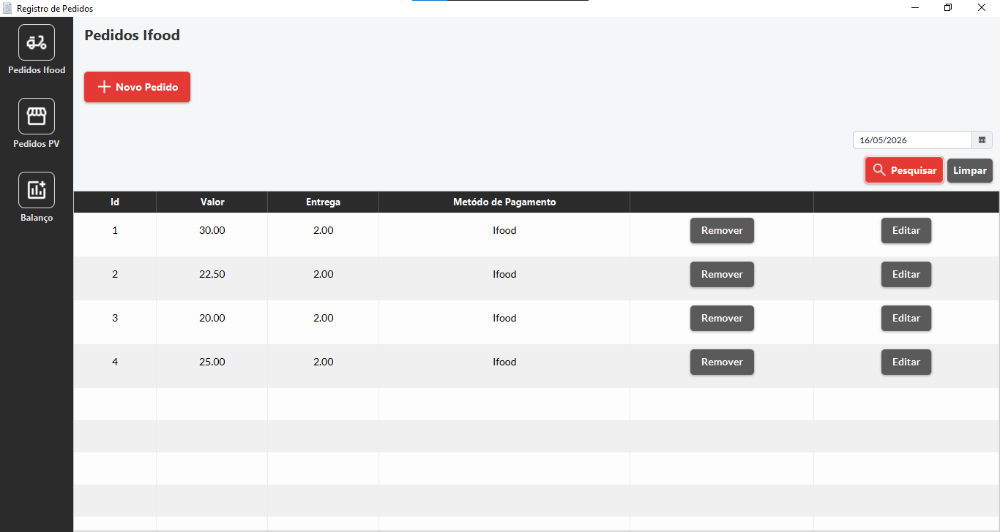
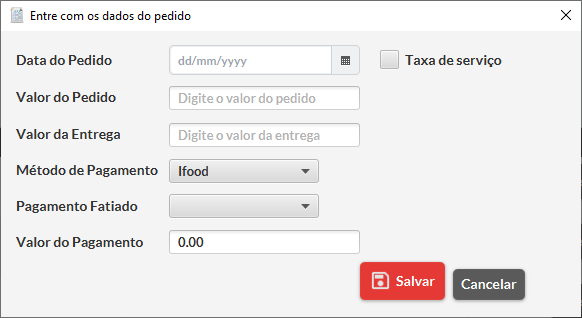
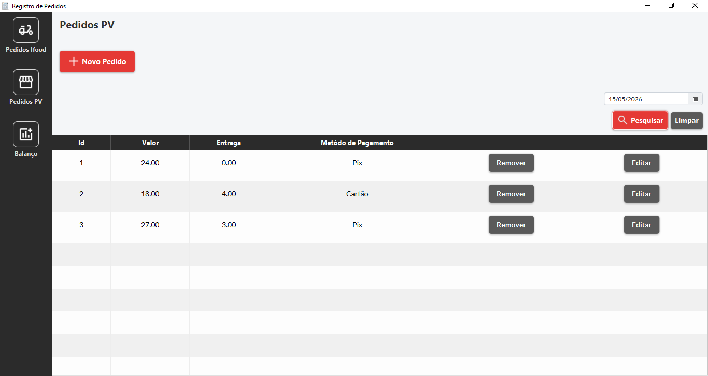
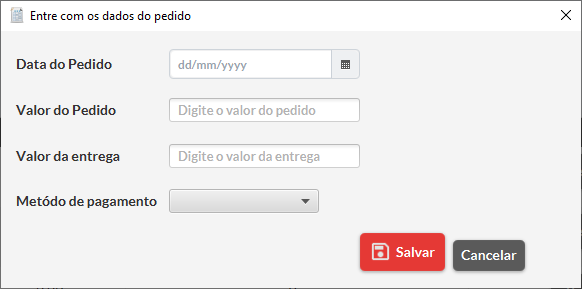
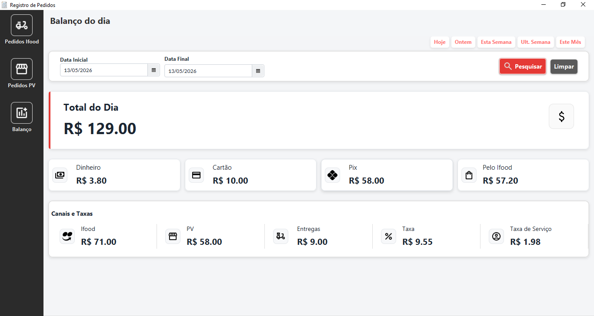

# Registro de Pedidos

## Descrição do Projeto

O **Registro de Pedidos** é uma aplicação desktop desenvolvida em Java com JavaFX para o gerenciamento de pedidos de um estabelecimento comercial (Lanchonetes, Restaurantes, etc). O sistema permite registrar, acompanhar e filtrar as vendas realizadas tanto pela plataforma iFood quanto por venda direta (PV - Ponto de Venda no balcão), oferecendo um histórico e um balanço financeiro detalhado.

O projeto evoluiu de um sistema de cadastro simples para um **Dashboard Gerencial**, construído utilizando o padrão de arquitetura MVC, manipulação de banco de dados via JDBC e interfaces gráficas responsivas.

## 🚀 Novidades da Versão Atual (v2.0)
- **Arquitetura "Single Table" e Polimorfismo:** Substituição do modelo antigo de múltiplas tabelas por uma tabela unificada (orders), reduzindo a repetição de código no Java e facilitando relatórios agregados.
- **Histórico e Filtros por Data:** Agora o sistema salva a data dos pedidos, permitindo gerar balanços de dias específicos, semanas ou meses.
- **Nova Interface de Resultados:** Adição de atalhos rápidos (Hoje, Ontem, Esta Semana, Este Mês), DatePickers interativos e ícones visuais para melhor experiência do usuário (UX).
- **Dashboard Financeiro Inteligente:** Implementação do padrão DTO (Data Transfer Object) e consultas SQL de agregação (SUM) para calcular o lucro líquido, separando o faturamento real das comissões e taxas da plataforma.
- **Refatoração de Banco de Dados:** Estrutura unificada com uso de `schema.sql` para facilitar a criação do banco.

## 📋 Funcionalidades

**1. Registro de Pedidos iFood:**
- Cadastro de novos pedidos com valor do produto, valor da entrega e método de pagamento.
- Cálculo automático de taxas e comissões da plataforma.
- Diferenciação de pedidos pagos pela loja ou pelo aplicativo.

**2. Registro de Pedidos Diretos (PV):**
- Cadastro de vendas diretas com valor do pedido, valor da entrega e forma de pagamento (Dinheiro, Cartão, Pix).

**3. Listagem e Gerenciamento:**
- Visualização de todos os pedidos registrados em tabelas separadas para iFood e PV.
- Opção para remover pedidos individualmente.

**4. Balanço Financeiro Avançado:**
- Tela de resultados que consolida as vendas filtradas por período.
- Exibe o faturamento total, total por canal (iFood/PV), total de entregas, comissões e valores recebidos por cada forma de pagamento.

## 📸 Telas do Sistema

Aqui estão algumas visões do sistema em funcionamento:

**Lista de Pedidos do Ifood** *Visão geral dos pedidos do Ifood.*
<br>


**Tela de Dialogo para Pedidos do Ifood**
<br>


**Lista de Pedidos dos Pedidos Diretos(PV)** *Visão geral dos pedidos Diretos(PV).*
<br>


**Tela de Dialogo para Pedidos Diretos**
<br>


**Dashboard de Balanço Diário** *Visão financeira gerencial com filtros de data*
<br>


## 🛠️ Tecnologias e Padrões Utilizados
- **Linguagem:** Java 17+
- **Interface Gráfica:** JavaFX (com CSS customizado para os Cards e Botões)
- **Banco de Dados:** H2 Database Engine (Modo File)
- **Acesso a Dados:** JDBC Puro
- **Padrões de Projeto:**
  - **MVC** (Model-View-Controller)
  - **DAO** (Data Access Object) genérico e polimórfico
  - **DTO** (Data Transfer Object) para relatórios
  - **Factory Method** para instanciação de serviços

## ⚙️ Como Executar o Projeto

Graças à nova arquitetura embarcada, rodar o projeto ficou extremamente simples. Não é necessário instalar nenhum banco de dados externo!

**1. Clone o Repositório:**
```bash
git clone https://github.com/MReis05/order-registration.git
```
**2. Importe na sua IDE:**
Abra o Eclipse (ou IntelliJ) e importe o projeto como "Existing Projects into Workspace"

**3. Verifique o Build Path:**
Certifique-se de que a biblioteca do JavaFX e o driver do H2 Database (h2-*.jar) estão adicionados ao Build Path do projeto.

**4. Execute:**
Rode a classe src/application/Main.java.
(Nota: O banco de dados banco_caixa.mv.db será criado automaticamente na pasta dados/ na primeira execução, utilizando o arquivo schema.sql fornecido na raiz).


**Autor**
Matheus Reis Cardoso

**LinkedIn:** https://www.linkedin.com/in/matheus-reis-cardoso-6a619120b/

**GitHub:** https://github.com/MReis05